# StudyLife Capture

[](https://github.com/lukislp/studylife-capture/actions/workflows/ci.yml)
[](https://github.com/lukislp/studylife-capture/releases)
[](LICENSE)
[](https://developer.chrome.com/docs/extensions/mv3/intro/)
[](https://www.typescriptlang.org/)

A Chrome extension (Manifest V3, TypeScript) for saving selected text or whole articles into
[StudyLife](https://github.com/lukislp/studylife) as notes, with AI enrichment handled by
[studylife-ai](https://github.com/lukislp/studylife-ai) — the same LLM/embeddings/Qdrant index
StudyLife's chat and agent features already use. Self-hosted by design: every install points at
your own StudyLife instance, there's no fixed backend to sign into.

This is a learning project and portfolio piece, built as a companion to the main
[StudyLife](https://github.com/lukislp/studylife) app. Design decisions and incidents
(a NetworkPolicy gap that silently blocked enrichment in production, and how it was found and
fixed) are logged in the sibling repos' own `docs/decisions.md`.

## Status: S1–S4 done

**S1** (scaffold): selection capture via a right-click context menu, a settings popup for the
server URL and API key, and a dedicated `CaptureApiKey` slot on the StudyLife side authenticating
directly against the existing `POST /api/notes` endpoint — no separate capture-specific endpoint
needed. **S2** (AI enrichment): a background task on the StudyLife side forwards every capture to
studylife-ai for course matching, tag suggestion, and a one-sentence summary, asynchronously after
the save already succeeded — a slow or unreachable AI service never blocks or risks the capture
itself. **S3** (richer capture): a second context-menu action extracts the whole article via
[Mozilla Readability](https://github.com/mozilla/readability) (the same engine behind Firefox's
Reader View) instead of just the selection, plus "related notes" suggestions and immediate search
indexing so a capture is findable right away, not after the next periodic sync. **S4** (polish):
specific, actionable error messages for offline/invalid-key/unreachable-server cases, a
connection test right in the settings popup, a packaged `.zip` release build, and full CI/CD
(lint, typecheck, build, semantic-release, GitHub Release with the `.zip` attached).

Every milestone was verified against a real, running StudyLife + studylife-ai instance — not just
unit tests — including a live production incident: the very first real capture assigned no course
at all, traced through Kubernetes logs to a `NetworkPolicy` that had never anticipated the new
background worker→AI traffic path, then to a second, independent finding that direct
course-embedding similarity is an unreliable signal on its own (a real match scored only 0.44
against a 0.75 threshold) — fixed with a fallback that matches against the user's own existing
notes/sessions instead, and confirmed live with a real capture correctly assigned to the right
course.

## Features

- **Save a selection** — highlight text on any page, right-click → *Save selection to StudyLife*.
- **Save a full article** — right-click anywhere on a page (no selection needed) → *Save full
  article to StudyLife*. Readability strips navigation, ads, and sidebar boilerplate, keeping
  only the actual article content.
- **AI enrichment**, applied automatically after saving, in the background:
  - **Course assignment**, scoped to your currently-active courses only. Matches directly against
    a course's own description first; if that's not confident enough, falls back to the most
    similar existing note or session you've already tagged to a course.
  - **Tags** and a **one-sentence summary**, generated by the same LLM your StudyLife chat/agent
    already uses.
  - **Related notes** — up to three existing notes on a similar topic, linked directly from the
    new note.
  - The capture is embedded and indexed immediately, so it's searchable via StudyLife's own
    chat/agent right away instead of waiting for the next periodic sync.
- **Clear error states** — a specific message for being offline, an invalid/revoked API key, or
  an unreachable server, both when capturing and when testing your settings.

## Installation

**[Install from the Chrome Web Store](https://chromewebstore.google.com/detail/studylife-capture/glhegeoapkifmhodpnbfjgijlflkdglh)** — the easiest way, gets automatic updates.

To install an unpacked build instead (e.g. to try an unreleased change):

1. Download the latest `studylife-capture-vX.Y.Z.zip` from the
   [Releases page](https://github.com/lukislp/studylife-capture/releases) and unzip it somewhere
   permanent (don't delete the folder afterward — Chrome loads the extension from there).
2. Go to `chrome://extensions`, enable **Developer mode** (top right).
3. Click **Load unpacked**, select the unzipped folder.

## Setup

1. Click the StudyLife Capture icon in Chrome's toolbar and enter your StudyLife server URL.
2. Click **Connect with StudyLife** — this opens your instance's login page in a new window
   (passkey sign-in + consent), then hands a `CaptureApiKey` straight back to the extension. No
   copy-pasting a key required — the browser consent flow is the only provisioning path (the
   StudyLife setup page no longer offers a capture key to copy either).

**Escape hatch for servers the auth window can't reach** (e.g. a self-signed certificate on a
local network): mint a key against the API with your session and place it in extension storage
yourself — there is deliberately no form for this anymore:

```bash
curl -s -X POST -H "X-Session-Token: <your session token>" \
  https://<your-server>/api/settings/capture-api-key/generate
# then, in the extension service worker console:
# chrome.storage.local.set({ settings: { serverUrl: "https://<your-server>", apiKey: "<key>" } })
```

## Architecture

```mermaid
flowchart LR
    Page["Web page\n(selection or full article)"]
    Ext["studylife-capture\n(background service worker)"]
    API["StudyLife\nPOST /api/notes"]
    Worker["StudyLife background task\n(BackgroundTaskService.CaptureEnrichment)"]
    AI["studylife-ai\nPOST /internal/enrich-capture"]
    Qdrant[("Qdrant\nnotes / sessions / courses")]

    Page -- "selection, or Readability-extracted article" --> Ext
    Ext -- "X-Api-Key" --> API
    API -. "SourceUrl set, unenriched" .-> Worker
    Worker -- "shared secret" --> AI
    AI -- "course match, tags,\nsummary, related notes" --> Worker
    AI <-. "embedding search /\nimmediate indexing" .-> Qdrant
    Worker -- "writes back" --> API
```



The extension itself never talks to studylife-ai directly — only to your own StudyLife server,
using a `CaptureApiKey` scoped to `POST /api/notes` alone (the same unified `X-Api-Key` gate
StudyLife's other integrations use). Enrichment happens afterward, server-side, authenticated
with a separate shared secret between StudyLife and studylife-ai the extension never sees.

## Security notes

- **No broad host access by default**: `http://*/*`/`https://*/*` are declared as
  `optional_host_permissions`, not `host_permissions` — nothing is granted at install time. Either
  connect path (browser or manual) requests access to exactly the one origin you're connecting to
  (`chrome.permissions.request`, scoped to that origin only); the grant then persists, so this
  only happens again if you point the extension at a different server.
- **Browser connect**: clicking **Connect with StudyLife** opens your own server's login/consent
  page via `chrome.identity.launchWebAuthFlow`, using a per-attempt random `state` value to make
  sure the assertion that comes back is the one this specific attempt actually requested — not a
  forged or replayed redirect. The resulting `CaptureApiKey` never passes through the developer or
  any third party; it's exchanged directly between your browser and your own server.
- **API key storage**: the server URL and API key live in `chrome.storage.local`, local to your
  browser profile, however you obtained the key. The key itself is a long-lived, revocable secret
  (StudyLife → Setup → generate a new one to rotate, or revoke to invalidate immediately) — never
  StudyLife's own login credentials.
- **Minimal permissions**: `contextMenus`, `storage`, `notifications`, `scripting` (for injecting
  the Readability-based article extractor), `activeTab` (grants that injection host access to
  only the current tab, only in response to the context-menu click that triggered it — no
  standing host permission needed for article capture at all), `identity` (opens the browser
  connect flow's login window and provides its `chromiumapp.org` redirect URL — nothing else).
- **No telemetry, no third-party requests**: the only network calls are to the StudyLife server
  origin you explicitly granted access to.

## Development

```bash
npm install
npm run typecheck
npm run build      # bundles src/ into dist/ via esbuild
npm run package     # zips dist/ into release/ (Chrome-Web-Store-ready)
npm run watch       # rebuild on change
```

`node build.mjs` produces two separate bundles: an ES module build for the background service
worker and popup, and a self-contained IIFE build for `article-extractor.ts` (injected into a
page as a classic script, where an ES module `import` statement can't resolve).

## Roadmap

- [x] **S1** — Scaffold: selection capture, settings popup, dedicated `CaptureApiKey` slot on
      StudyLife, direct `POST /api/notes` integration (no separate capture endpoint needed).
- [x] **S2** — AI enrichment: course matching, tags, summary, forwarded asynchronously via a
      StudyLife-side background task so a slow/unreachable AI service never blocks a capture.
- [x] **S3** — Full-article extraction via Mozilla Readability, related-notes suggestions,
      immediate Qdrant indexing instead of waiting for the next periodic sync.
- [x] **S4** — Specific offline/invalid-key/unreachable-server error messages, a connection test
      in the settings popup, packaged `.zip` release build, full CI/CD with semantic-release.
- [x] Production-verified course matching: found and fixed a live NetworkPolicy gap and a
      direct-course-embedding-confidence issue, confirmed with a real capture correctly assigned.
- [x] Minimal permissions: replaced broad `host_permissions` with `optional_host_permissions` +
      a runtime request scoped to the exact server origin, and `activeTab` instead of a standing
      host grant for article extraction — narrows the permission surface a Chrome Web Store
      review actually looks at.
- [x] [Chrome Web Store listing](https://chromewebstore.google.com/detail/studylife-capture/glhegeoapkifmhodpnbfjgijlflkdglh) —
      submitted 2026-08-21 (v1.3.1), approved and live 2026-08-22 — under a day, well inside
      Google's own "up to a few weeks" estimate.

Course-matching/tag/summary accuracy across a larger set of real captures is tracked in
[studylife-ai](https://github.com/lukislp/studylife-ai)'s own roadmap — that's where the actual
enrichment logic lives, not here.

## Tech stack

| Component | Technology |
|---|---|
| Extension | Manifest V3, TypeScript (strict), esbuild |
| Article extraction | [`@mozilla/readability`](https://github.com/mozilla/readability) |
| Packaging | `archiver` (`npm run package` → Chrome-Web-Store-ready `.zip`) |
| CI/CD | GitHub Actions (typecheck, `npm audit`, build, semantic-release, GitHub Release with the packaged `.zip` attached) |
| Backend | [StudyLife](https://github.com/lukislp/studylife) (`POST /api/notes`, `X-Api-Key`) |
| AI enrichment | [studylife-ai](https://github.com/lukislp/studylife-ai) (`POST /internal/enrich-capture`) |

## Privacy

See [PRIVACY.md](PRIVACY.md) — in short, nothing leaves your device except to the StudyLife
server you explicitly configure. No analytics, no telemetry, no third party.

## License

[AGPL-3.0](LICENSE), matching the main [StudyLife](https://github.com/lukislp/studylife) repository.
